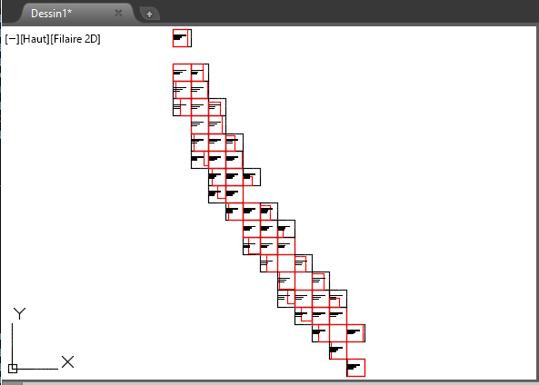
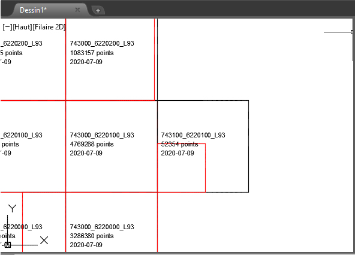

# traceAreaLas 1.1

traceAreaLas is a small program in Python 3.11 which traces in Autocad the extent of the .las files.

When you receive a large amount of point clouds from a Lidar, a scouting plan is a definite help.

Insert a block for each .las file containing
 - 2 Polylines
   - the theoretical area (100m x 100m)
   - the real area in red
 - 3 Attributs
   - the name of the file
   - the number of points
   - the date of the survey

 


## Installation

   - No installation for .exe
   - for .py you have to install pyautocad and laspy

```
pip install pyautocad
pip install laspy
```

## Requirements

  Only for Windows

  Autocad must be installed

## Usage

  - Start Autocad and open the destination drawing.

  - Otherwise Autocad will start with drawing1.dwg.

  - Start traceAreaLas

  - Choose .las files

  - Wait a minute


## License

  No license
